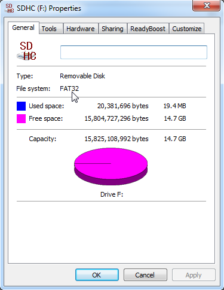
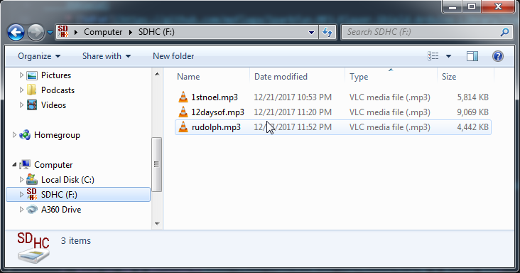
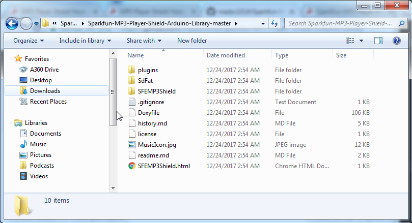
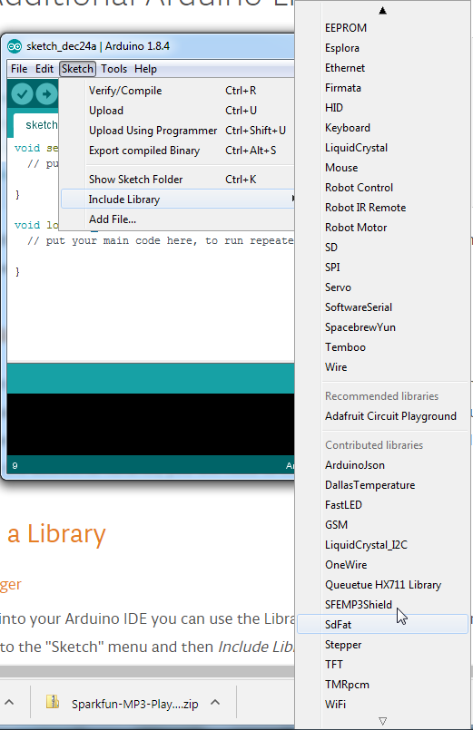
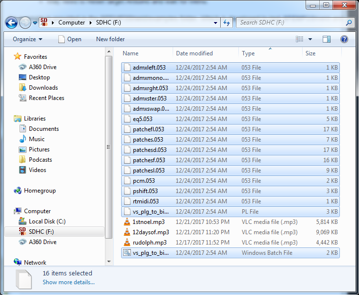
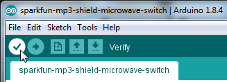
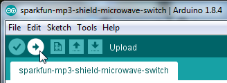

# sparkfun-mp3-shield-microwave-switch
_In 2017, your microwave plays music while you reheat french fries..._

## Table of Contents
* [Summary](#summary)
* [Requirements](#requirements)
* [Installation](#installation)
  * [Prepare Micro SD](#prepare-micro-sd)
  * [Install Arduino IDE](#install-arduino-ide)
  * [Install SFEMP3Shield Library](#install-arduino-sfemp3shield-library)
  * [Download Repo](#download-and-extract-repo)
  * [Open Sketch](#open-sketch-in-arduino-ide)
  * [Edit Sketch](#edit-sketch-and-add-song-names)
  * [Upload Sketch](#verify-and-upload-sketch)
* [Support](#support)
* [Resources](#resources)

## Summary
This repository contains an Arduino sketch for
the musical microwave project. Check it out on
[YouTube](link to YouTube) and
[Instructables](link to Instructables) for a demonstration and detailed instructions.

## Requirements
* Hardware
  * [Arduino UNO](https://store.arduino.cc/usa/arduino-uno-rev3)
  * [SparkFun MP3 Player Shield](https://www.sparkfun.com/products/12660)
  * [Arduino Stackable Header Kit - R3](https://www.sparkfun.com/products/11417)
  * [3.5mm Male-to-Male Stereo Audio AUX Cable](http://a.co/3FVRnBt)
  * [Speaker with AUX Input](http://a.co/00E7tHy)
  * [Male-to-Female Jumper Wires](https://www.sparkfun.com/products/12794)
  * [3-Pin SPDT Micro Switch](http://a.co/1Jljt22)
  * [Micro SD](http://a.co/2HIo4hr)

* Tools
  * Computer
  * [USB 2.0 Cable Type A/B](https://store.arduino.cc/usa/usb-2-0-cable-type-a-b)

## Installation

### Prepare Micro SD
1. [Format your Micro SD card to FAT32](https://gopro.com/help/articles/Solutions_Troubleshooting/SD-Card-Reformat-on-a-Windows-Computer).

   

2. Add your .mp3 files to the Micro SD.
   Each .mp3 file must:  
   i. have an [8.3 filename](https://www.computerhope.com/jargon/num/8-3-format.htm) (8 characters + '.mp3' in our case),  
   ii. have a bitrate of no more than [320 kbps](https://www.sparkfun.com/datasheets/Components/SMD/vs1053.pdf),   
   iii. and have a sample rate of no more than [48 kHz](https://www.sparkfun.com/datasheets/Components/SMD/vs1053.pdf).  

   

   Notice that I had to rename my .mp3 files in order to meet the 8.3 filename requirement.

### Install Arduino IDE
1. Download the latest Arduino IDE via https://www.arduino.cc/en/Main/Software.
2. Install the Arduino IDE.  
   i. Official installation instructions can be found [here](https://www.arduino.cc/en/Guide/HomePage).

   If this is your first time using an Arduino, you should consider looking
   at some of the [Built-In Examples](https://www.arduino.cc/en/Tutorial/BuiltInExamples).

### Install Arduino SFEMP3Shield Library
1. Download the Sparkfun-MP3-Player-Shield-Arduino-library  
   i. Go to https://github.com/madsci1016/Sparkfun-MP3-Player-Shield-Arduino-Library.  
   ii. Left-click `Clone or download`.  
   iii. Left-click `Download ZIP`.
2. Extract the downloaded .zip file.
3. Navigate to the extracted `~\Sparkfun-MP3-Player-Shield-Arduino-Library-master\Sparkfun-MP3-Player-Shield-Arduino-Library-master` directory.  

   
4. Install the SdFat and SFEMP3SHIELD Arduino Libraries  

 _Windows_  
     i. Copy the `SdFat` and `SFEMP3SHIELD` folders into the `~\Documents\Arduino\library` directory.

   _Mac_  
     i. Right-click on the Arduino app.  
     ii. Select `Show Package Contents`.  
     iii. Navigate to `Contents` > `Resources` > `Java` > `libraries` (if the `libraries`   directory does not exist, create it).  
     iv. Copy the `SdFat` and `SFEMP3SHIELD` folders into the `libaries` directory.
5. Restart the Arduino IDE if it was open.
6. In the Arduino IDE, go to `Sketch` > `Import Libary` and confirm that both libaries are listed.

    

7. Add the patch files to the Micro SD.  
   i. Return to the extracted `~\Sparkfun-MP3-Player-Shield-Arduino-Library-master\Sparkfun-MP3-Player-Shield-Arduino-Library-master` directory.  
   ii. Open the `plugins` folder.  
   iii. Copy all the files inside the `plugins` folder onto your Micro SD.  

   

### Download and Extract Repo
1. Download [this repository](https://github.com/The-Engineer-Channel/musical-microwave-arduino-mp3-shield):  
  i. Left-click `Clone or download`.  
  ii. Left-click `Download ZIP`.
2. Extract the downloaded .zip file.

### Open Sketch in Arduino IDE
1. Connect Arduino UNO to computer using a USB 2.0 Cable Type A/B.
2. Navigate to the extracted `~\musical-microwave-arduino-mp3-shield\sparkfun-mp3-shield-microwave-switch` directory.
3. Open `sparkfun-mp3-shield-microwave-switch.ino` in the Arduino IDE.
4. Make sure the appropriate Board and Port are selected:  
  i. `Tools` > `Board` > `Arduino/Genuino Uno`  
  ii `Tools` > `Port` > `COM# (Arduino/Genuino Uno)`

### Edit Sketch and Add Song Names
1. Replace this section of the code with the .mp3 filenames on
your Micro SD.  

  

### Verify and Upload Sketch
1. Verify the sketch.  

  

2. Upload the sketch to the Arduino UNO.   

  

  If the sketch fails to upload...
  * Make sure the Arduino is connected.
  * Check that the `Board` and `Port` settings are correct.
  * Google the problem.

## Support
* If you run into an issue with the sketch, feel free to [create an issue](https://help.github.com/articles/creating-an-issue/) in this repository.
* If you would like to improve this sketch (or perhaps share a similar sketch for others to use), feel free to [fork this repository and submit a pull request](https://gist.github.com/Chaser324/ce0505fbed06b947d962) with your changes.

I'll do my best to respond to issues and pull requests!

## Resources
### Arduino
* [Arduino Official Website](https://www.arduino.cc/en/Guide/HomePage)
  * [Download the Arduino IDE](https://www.arduino.cc/en/Main/Software)
  * [Getting Started with Arduino and Genuino UNO](https://www.arduino.cc/en/Guide/ArduinoUno)
  * [Installing Additional Arduino Libraries](https://www.arduino.cc/en/Guide/Libraries)

### SparkFun MP3 Player Shield
* [MP3 Player Shield Hookup Guide V15](https://learn.sparkfun.com/tutorials/mp3-player-shield-hookup-guide-v15) _Great comprehensive tutorial_
* [Arduino SFEMP3Shield Library](https://github.com/mpflaga/Sparkfun-MP3-Player-Shield-Arduino-Library)
  * [Documetation](http://mpflaga.github.io/Sparkfun-MP3-Player-Shield-Arduino-Library/)

### GitHub
* [What is GitHub, and What Is It Used For?](https://www.howtogeek.com/180167/htg-explains-what-is-github-and-what-do-geeks-use-it-for/)
* [Mastering Markdown](https://guides.github.com/features/mastering-markdown/) _(This README was written using Markdown syntax)_

### Git
* [1.3 Geting Started - Git Basics](https://git-scm.com/book/en/v2/Getting-Started-Git-Basics)
* [Git Beginner's Guide for Dummies](https://backlog.com/git-tutorial/en/)
